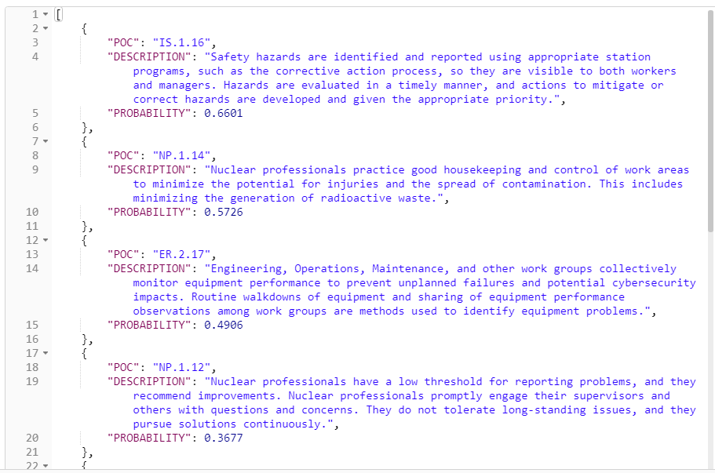

# Smart Performance Objective and Criteria Coding (SPOC)
Automated Application of the INPO Performance Objective and Criteria Codes

#License

```
Copyright (C) Arizona Public Service - All Rights Reserved 

Any referenced libraries utilized within are licensed per original author. 

THE SOFTWARE IS PROVIDED "AS IS", WITHOUT WARRANTY OF ANY KIND, EXPRESS OR
IMPLIED, INCLUDING BUT NOT LIMITED TO THE WARRANTIES OF MERCHANTABILITY,
FITNESS FOR A PARTICULAR PURPOSE AND NONINFRINGEMENT. IN NO EVENT SHALL THE
AUTHORS OR COPYRIGHT HOLDERS BE LIABLE FOR ANY CLAIM, DAMAGES OR OTHER
LIABILITY, WHETHER IN AN ACTION OF CONTRACT, TORT OR OTHERWISE, ARISING FROM,
OUT OF OR IN CONNECTION WITH THE SOFTWARE OR THE USE OR OTHER DEALINGS IN THE
SOFTWARE.

Written by Jerrold Vincent <jerrold.vincent@aps.com> and Bradley Fox
<bradley.fox@aps.com> September 2018
```

# Purpose
This repo contains products produced during the SPOC hackathon at APS/Palo Verde corporate offices on Sep 11/12, 2018. Products produced were:

1.	Docker Container that:
    *  Encapsulates computing environment required to run scripts
    *  Creates and hosts a REST API that returns POC Codes
2.	Batch POC Coding Script with command line interface
3.	Report Generation Script for monitoring most increasing/decreasing POC Counts


# Dependencies
1.	Docker
    *	Install Docker from docker.com
    *	Follow Docker Setup Instructions for creating Docker image
    *	Move SPOC files into Docker container and run via container command line

  OR 

2.	Local Installation of:
    *	Python (2 or 3)
        *	Packages: Numpy, Tensorflow, Keras
*	R (recent or latest version)
    *	run ‘install_dependencies.R’ in the SPOC folder
*	R Studio (recent or latest version)


# Project Files
Updated list of files that include what was developed during the hackathon.
- **data**
    - **crs** | where site CR data will reside
    - **model**
        - **ktt.pkl** | text tokenizer
        - **model_incremental.model** | incrementally trained model
        - **model.json** | model configuration
        - **model.model** | original Palo Verde model weights
    - **pocs** | where site POC data will reside
    - **pocdecoder.RDS** | used to decode raw neural network outputs
    - **poclkp.RDS** | detailed lookup to raw PO&Cs
- **shiny** | exposes model as easy to use web app
  - **server.R**
  - **ui.Rv
- **app.sh** | runs shiny server
- **install_dependencies.R** | installs all R dependencies
- **industry_helper_functions.R** | code for maintaining a local database of CR/POC data
- **interactive.R** | code for interacting with model
- **load_pv_Crs.R** | example of how Palo Verde loads initial training data
- **plumber.R** | exposes SPOC via a rest API
- **train_model_incremental.R** | initializes weights to Palo Verde  trained models, then feeds in new data
- **train_model.R** | trains a new model from scratch
- **ExamplePOCTrendReport.pdf** | Example pdf output from POC code date trending script
- **code_batch_text.R** | code to make predictions in batch and output csv file
- **POC_output_report_script.rmd** | code to generate report on poc trends over time
- **POC_code_date_trending_experiment.R**| code to analyze poc trends over time


# Basics/Tutorial
1.	Open a command line/powershell prompt, and navigate to the parent SPOC directory (where the dockerfile and docker-compose.yml files are)

2.	Run the following command to build the docker container: 

    ```bash
    docker build -t pv/spoc:1.0 .
    ```

3.	[Only proceed if you want to setup the REST API web server] After the docker build completes (this may take up to an hour or two), you can run the web server by running:

    ```bash
    docker-compose up   
    ```

    or, if you want to detach the command from the command prompt,

    ```bash
    docker-compose up -d
    ```

4.	You can shutdown the web server by hitting ctrl-C if you did not detach the command prompt, or by running 
    ```bash
    docker-compose down
    ```

# Batch Coding Instructions

This script will take a .CSV file with a unique identifier e.g. CR Number in the first column, and some text in the 2nd column e.g. CR Description, and output the probability that each of the approximately 900 INPO POC codes are applicable. 

Data Setup:

1. Create a .CSV file with 2 columns, first column header SITEUID, second column CRTEXT.  Paste CR numbers in the first column, one per row.  Paste the associated CR descriptions in 2nd column, one per row.

2.	Save as .CSV and place in the root directory of the SPOC project folder. I.e. “/SPOC/your_csv_file.csv”

Script Run:

1.	Open a command prompt and navigate to the SPOC directory.

2.	Execute the POC batch script with the following command in the SPOC directory:

    ```bash
    Rscript code_batch_text.R your_csv_file.csv output_file.csv
    ```

    where your_csv_file.csv is the csv you created, and output_file.csv is the name of the file for POC output. 

    Note: RScript may need to be replaced with the full path to RScript.exe. on my machine it is:
    C:\Users\z08273\Documents\R\R-3.5.1\bin\x64\RScript.exe

3.	The script will complete and the results will be in your specified “output_file.csv”.  The columns are the POC codes and each cell contains the probability that the POC code applies to that unique CR.

# Batch Reporting Instructions

This operation will take a CSV similar to Batch Coding, but with a date column, and produce a report that returns the 5 most increasing and decreasing POC codes over the last specified short time period when compared to the last specified longer period’s simple moving average.  This value is calculated by summing the probability that a POC would have been applied to any given CR over that time frame.  For example, we might look at POC performance over the last 30 days compared to a year or 7 days compared to a month.

A PDF print out of an example report is contained at SPOC/ExamplePOCTrendReport.pdf

Data Setup:
1.	 Create a .CSV file with 3 columns, first column header SITEUID, second column DATE in format “m/d/y hour:min” ie 10/12/92  12:00 or 1/1/01 03:17, third column CRTEXT.  Paste CR numbers in the first column, one per row, dates in 2nd column, and associated CR descriptions in 3nd column, one per row.

2.	Save as .CSV and place in the root directory of the SPOC project folder. I.e. “/SPOC/your_csv_file.csv”

Script Run:

3.	Open a command prompt and navigate to the SPOC directory.

4.	Execute the POC batch script with the following command

    ```bash
    Rscript –e “rmarkdown::render(‘poc_output_report_script.rmd’, ‘report_output’) your_csv_file.csv your_output.csv short_time long_time date_back 
    ```

    where your_csv_file.csv is the csv you created, and output_file.csv is the name of the file for POC output. Replace short_time with the shorter time period, e.g 7 for 7 days, and long_time with the longer time period e.g. 31 for a month or 365 for a year.  Specify date_back in format “YYYY-mm-dd” which control how far back in time you want to go. 

    Note: RScript may need to be replaced with the full path to RScript.exe. on my machine it is:
    C:\Users\z08273\Documents\R\R-3.5.1\bin\x64\RScript.exe
	
    Alternatively, you can open the the poc_output_report_script.rmd file in RStudio,   and manually run it, by clicking “knit” in the toolbar.

5.	The script will complete and the results will be in ‘report_output’ html file. 

# REST API Setup
If you’ve setup the REST API Web Server, you can call it with a simple HTTP Post command from any application.  The REST API is on the web server behind http://[URL]:8000/pocs, and requires a JSON post body.  There are five named parameters that need to be provided, but only the “TEXT” value is required:

```json
{
  "text": "Text to get PO&C codes for",
  "pocDescriptions": true,    // Whether PO&C descriptions should be
                              // returned
  "probabilities": true,      // Whether PO&C probabilities should be 
                              // returned
  "topN": 10,                 // Limits to top N most applicable 
                              // results
  "probabilityThreshold": 0.0 // Limits to PO&C codes with at least
                              // this probability
}
```
Here is a screenshot of what a properly formatted request would look like, using the POSTMAN REST tool, with a locally deployed REST API Web Server:
 


A successful REST call will return data that looks similar to this:



# Model Retraining
```Note
You should have at least 5,000 CRs to perform the retraining process. More is ALWAYS recommended.
```

1. Copy the attached “EXAMPLE_load.R” to the SPOC folder where the other source R files are located.
2. In the project “data” folder, add a new “load” folder.
3. Create 3 new csv files, “crs.csv”, “pocs.csv”, and “pocdecoder.csv”.  Examples of these files are attached.  The project should look like this:
4.	Run the following commands from the command line to build and run the docker container:
    ```bash
    docker build --rm -f "dockerfile" -t spoc .

    docker run -t -d spoc
    ```
    Copy the result returned from the above command.  This will be our “Container ID”

    ```bash
    docker exec [CONTAINER ID HERE] "bash" -c 'cd /usr/SPOC && Rscript EXAMPLE_load.R && Rscript train_model.R'

    docker stop [CONTAINER ID HERE]
    ```
5.	If everything is setup correctly (docker, volume, etc.),  the projects model should now be retrained.
